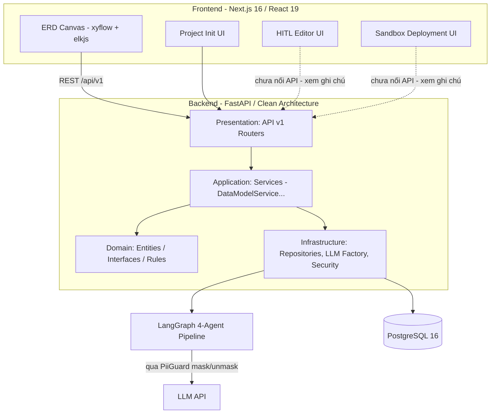
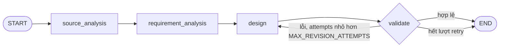
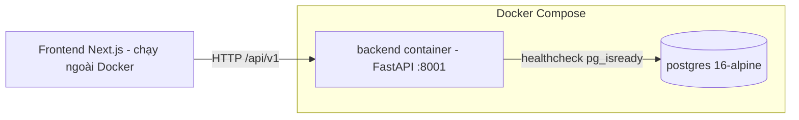

# Architecture Document

## System Overview

AI20K Agent System tự động hoá quy trình thiết kế Data Warehouse: từ yêu cầu nghiệp vụ thô và mô tả dữ liệu nguồn do người dùng nhập, hệ thống chạy một pipeline LangGraph gồm 4 agent tuần tự (phân tích nguồn → trích yêu cầu → thiết kế mô hình → kiểm định) để sinh ra schema dạng DBML, sau đó cho phép người dùng xem/chỉnh sửa trực quan trên ERD canvas trước khi xuất DDL. Toàn bộ dữ liệu nhạy cảm được che (mask) trước khi rời hệ thống tới LLM API bên thứ ba. Backend theo Clean Architecture/DDD (4 lớp domain/application/infrastructure/presentation), frontend là Next.js.

## Architecture Diagram

> **Ghi chú:** `HITL Editor UI` và `Sandbox Deployment UI` đã có khung UI ở `frontend/src/features/{hitl-editor,sandbox-deployment}` nhưng endpoint backend tương ứng chưa hoàn thiện — xem phần *Data Flow* bên dưới.

## Components

### 1. Frontend (Next.js / React)

- **Purpose:** Giao diện cho người dùng nhập requirement/source data thô, kích hoạt pipeline sinh mô hình, xem và chỉnh sửa kết quả trên sơ đồ ERD trực quan.
- **Key Features:**
  - `features/project-init` — khởi tạo dự án, nhập requirement/source data.
  - `features/modeling-dashboard/modeling-workspace/erd-canvas` — canvas ERD dùng `@xyflow/react` để dựng node/edge và `elkjs` để tự động sắp xếp layout sơ đồ (`use-erd-auto-layout.ts`).
  - `features/hitl-editor`, `features/sandbox-deployment` — khung UI cho vòng duyệt của con người và deploy thử; đang phát triển (xem ghi chú Data Flow).
- **State Management:** Zustand (state cục bộ) kết hợp Axios gọi REST API; UI kit dựng trên Radix UI + Tailwind CSS v4; đa ngôn ngữ qua i18next.

### 2. Backend (FastAPI)

- **Purpose:** Expose REST API cho frontend, điều phối use-case (application layer), gọi pipeline AI Agent, và lưu trữ dữ liệu vào PostgreSQL.
- **API Design:** RESTful, versioned dưới `/api/v1`, router con theo domain: `projects`, `requirements`, `data_sources`, `analytical_requirements`, `data_models`, `data_model_changes`, `sessions`, `users`, `auth`, `workflows` (`backend/src/presentation/api/v1/`). FastAPI tự sinh OpenAPI/Swagger.
- **Authentication:** JWT (`infrastructure/security/jwt.py`, `authentication.py`) + hashing mật khẩu (`infrastructure/security/password.py`), điều phối qua `application/auth/auth_service.py`.
- **Kiến trúc nội bộ:** Clean Architecture 4 lớp — `domain` (entity thuần, interface như `IDataModelGenerator`, rule nghiệp vụ như `validate_dbml`), `application` (use-case, VD `DataModelService.generate_data_model`), `infrastructure` (implement cụ thể: `LangGraphDataModelGenerator`, repository Postgres, LLM factory), `presentation` (router, DTO, exception handler). Ví dụ chuỗi gọi thật: `POST /projects/{id}/data-model/generate` → `DataModelService` → `IDataModelGenerator` (interface, domain) → `LangGraphDataModelGenerator` (implementation, infrastructure) — đúng nguyên tắc Dependency Inversion.

### 3. AI Agent (LangGraph)

- **Agent Type:** Không phải ReAct/tool-calling agent — là một `StateGraph` tuyến tính có 1 vòng lặp retry điều kiện (4 node cố định, thứ tự cố định).
- **State:** `DwPipelineState` (`infrastructure/agents/state.py`, `TypedDict total=False`) gồm: `raw_requirements`, `raw_data_sources` (đầu vào thô) → `analyzed_schema` (SourceDataAgent sinh) → `analytical_requirements` (RequirementAgent sinh) → `proposed_dbml`, `summary` (DWDesignAgent sinh) → `validation_error`, `attempts` (trạng thái điều phối).
- **Nodes** (hằng số tên node tại `infrastructure/agents/constants.py`):
  1. `source_analysis` — `SourceDataAgent`, phân tích cấu trúc dữ liệu nguồn thô.
  2. `requirement_analysis` — `RequirementAgent`, trích yêu cầu + kết hợp source data đã phân tích thành `AnalyticalRequirement`.
  3. `design` — `DWDesignAgent`, tổng hợp yêu cầu + nguồn dữ liệu, sinh DBML đề xuất.
  4. `validate` — `ValidationEngine`, kiểm tra không còn sót placeholder PII (fail-closed) rồi kiểm tra cú pháp DBML (`domain/data_model/rules.py::validate_dbml`).
  - Retry: nếu `validate` lỗi và `attempts < MAX_REVISION_ATTEMPTS` (= 3, cố tình đặt thấp để cả pipeline chạy dưới 45s theo NFR2) → quay lại `design`; ngược lại → `END`.
- **Tools:** Pipeline không dùng LangChain tool-calling — mỗi node gọi LLM trực tiếp bằng prompt cấu trúc riêng (`infrastructure/agents/prompts/{source_analysis,requirement,dw_design}.py`) rồi parse output có cấu trúc.
- **Flow:**

> **Ghi chú kỹ thuật (nợ codebase):** `infrastructure/agents/graph.py` và `infrastructure/agents/schema_agent.py` import từ các module không tồn tại (`src.agents.*`, `src.models.*`) và không được import ở bất kỳ đâu khác trong repo — đây là scaffold/ví dụ ban đầu, **không phải** pipeline thật đang chạy production (pipeline thật nằm ở `infrastructure/agents/workflows/dw_design.py` + `nodes/`). Tương tự, `infrastructure/agents/tools/` (trừ `example_tool.py`) không được node thật nào import. Nên dọn dẹp hoặc archive các file này để tránh nhầm lẫn khi review.

### 4. Database

- **Type:** PostgreSQL 16 (`postgres:16-alpine`, chạy qua `docker-compose.yml`).
- **Tables chính** (suy ra từ repository layer `infrastructure/repositories/`): requirements thô, data sources thô, `analytical_requirements`, `data_models` (DBML chính thức + revision hiện tại — cập nhật dùng optimistic locking, xem `update_current_data_model`), `data_model_changes` (lịch sử đề xuất thay đổi, trạng thái `PROPOSED`/`approved`/`rejected` theo thiết kế ở `docs/guide_cho_ca_nhom/data_flow.md` — **API route `data_model_changes.py` hiện là file rỗng, đang phát triển ở nhánh `feature/reject-proposal`**), user/auth.
- **Migrations:** Alembic.
- **Access pattern:** SQLAlchemy async (`asyncpg`) qua Repository + Unit of Work (`infrastructure/transaction/sqlalchemy_unit_of_work.py`), tách khỏi domain/application theo interface (VD `IDataModelService`).

## Data Flow

1. **Nhập liệu:** User nhập Requirement/Source Data thô trên Frontend (`project-init`) → Backend lưu vào PostgreSQL qua các repository tương ứng (`requirements`, `data_sources`).
2. **Kích hoạt pipeline:** User (hoặc luồng tự động) gọi `POST /api/v1/projects/{project_id}/data-model/generate`. `DataModelService.generate_data_model` nạp requirement + source data đã lưu, gọi `LangGraphDataModelGenerator`.
3. **Pipeline 4-agent chạy:** `source_analysis` → `requirement_analysis` → `design` → `validate` (xem sơ đồ Flow ở trên). Mỗi bước gọi LLM đều đi qua `PiiGuard` (`infrastructure/security/pii_guard.py`): che dữ liệu nhạy cảm → gọi LLM API → hoàn nguyên. Ở bước `validate`, nếu LLM trả về mà còn sót mã ẩn danh PII, hệ thống coi là lỗi và bắt retry (fail-closed), không để lọt vào kết quả chính thức.
4. **Lưu kết quả:** DBML hợp lệ được `DataModelService` lưu vào bảng `data_models` qua `PostgresDataModelRepository` + `SqlAlchemyUnitOfWork`.
5. **Xem & chỉnh sửa thủ công:** Frontend lấy DBML qua `GET .../data-model`, hiển thị trên ERD Canvas (`@xyflow/react` + `elkjs`); người dùng chỉnh tay và lưu qua `PUT .../data-model` (optimistic locking theo revision).
6. **Duyệt & xuất mã (đang phát triển, chưa hoàn thiện trên `main`):**
   - HITL approve/reject đề xuất thay đổi: thiết kế trong `docs/guide_cho_ca_nhom/data_flow.md` (bảng `data_model_changes`, trạng thái `PROPOSED` → `approved`/`rejected`), frontend đã có khung `features/hitl-editor`, nhưng router `data_model_changes.py` ở backend hiện rỗng — đang code ở nhánh `feature/reject-proposal`.
   - Sandbox dry-run DDL: mô tả trong tài liệu là chạy thử DDL trên schema giả lập trước khi duyệt; frontend có khung `features/sandbox-deployment`, nhưng logic sandbox thật trong backend hiện chỉ tồn tại dạng mock/hardcode trong `schema_agent.py` (file scaffold chưa nối vào pipeline chính — xem ghi chú ở mục AI Agent).
   - Codegen xuất SQL từ DBML: từng có (PR #9 "Tải xuống file SQL và xem đề xuất thay đổi"), đã bị revert (PR #14) — cần làm lại.

## Deployment Architecture

`docker-compose.yml` hiện chỉ khai báo 2 service: `postgres` (có `healthcheck` bằng `pg_isready`) và `backend` (build 2-stage từ `Dockerfile` gốc repo, chạy user non-root `appuser`, `healthcheck` gọi `GET /health`, `depends_on: postgres` với điều kiện `service_healthy`). **Frontend chưa được containerize** — không có `frontend/Dockerfile`, hiện chạy độc lập (dev: `next dev`).

## Security

- **Security Headers:** `SecurityHeadersMiddleware` (`common/middleware/security.py`) tự gắn `X-Content-Type-Options: nosniff`, `X-Frame-Options: DENY`, `Referrer-Policy: strict-origin-when-cross-origin`, `X-XSS-Protection`, và `Strict-Transport-Security` khi bật HSTS cho production.
- **CORS:** `common/middleware/cors.py`.
- **Authentication:** JWT (`infrastructure/security/jwt.py`, `authentication.py`) + hashing mật khẩu (`password.py`).
- **PII Guard:** `infrastructure/security/pii_guard.py` che dữ liệu nhạy cảm trước khi gửi tới LLM API bên thứ ba (mask → gọi LLM → unmask), và chặn fail-closed ở bước `validate` nếu phát hiện mã ẩn danh còn sót lại trong DBML trả về.
- **Input validation:** Pydantic DTO ở tầng presentation (`presentation/dtos/`, `presentation/schemas/`).
- **Secrets:** `.env` không commit (`.gitignore`), có `.env.example` làm mẫu; API key/secret injected qua `env_file` trong `docker-compose.yml`.
- **Chưa có (cần bổ sung nếu ra production):** rate limiting — hiện không tìm thấy middleware hay thư viện rate-limit nào trong `backend/src`.

## Design Decisions

| Decision | Choice | Reason |
|----------|--------|--------|
| Backend framework | FastAPI | Async I/O phù hợp gọi LLM API độ trễ cao; tự sinh OpenAPI/Swagger; type-safe với Pydantic |
| Kiến trúc backend | Clean Architecture 4 lớp (domain/application/infrastructure/presentation) | Domain không phụ thuộc chi tiết kỹ thuật (DB, LLM provider cụ thể) — đổi provider hay ORM không đụng business rule; ví dụ `IDataModelGenerator` (domain) tách khỏi `LangGraphDataModelGenerator` (infrastructure) |
| Agent orchestration | LangGraph `StateGraph` tuyến tính + retry có điều kiện | Cần pipeline nhiều bước có trạng thái chia sẻ (`DwPipelineState`) và vòng lặp retry có điều kiện (`validate` → `design`) — không cần tool-calling/ReAct vì thứ tự bước đã biết trước |
| Giới hạn retry | `MAX_REVISION_ATTEMPTS = 3` | Đặt thấp hơn nhiều so với `settings.agent_max_iterations` (=10) vì cả pipeline phải trả kết quả dưới 45 giây (NFR2) |
| Database | PostgreSQL 16 | Cần transaction/consistency mạnh cho optimistic locking khi cập nhật `data_models` theo revision |
| ORM & migration | SQLAlchemy (async, `asyncpg`) + Alembic | Async khớp FastAPI; Alembic quản lý version schema có kiểm soát |
| Định dạng mô hình dữ liệu | DBML (`lark-dbml`, `pydbml`) + `sqlglot` để sinh SQL | DBML dễ đọc/diff cho con người review (HITL) hơn SQL thô; `sqlglot` hỗ trợ sinh DDL đa dialect từ cùng một DBML |
| PII Guard đặt ở tầng infrastructure/security | Mask trước khi gọi LLM, unmask khi nhận về, fail-closed nếu sót | Dữ liệu nguồn thật của doanh nghiệp không được rời hệ thống dưới dạng thô khi gọi LLM API bên thứ ba |
| Frontend framework | Next.js 16 + React 19 | App router, hệ sinh thái React quen thuộc với team |
| ERD visualization | `@xyflow/react` + `elkjs` | `xyflow` dựng canvas kéo-thả node/edge; `elkjs` tự động layout sơ đồ ERD phức tạp thay vì tự tính toán vị trí |
| State management (frontend) | Zustand | Nhẹ hơn Redux, đủ cho state cục bộ của canvas/editor |
