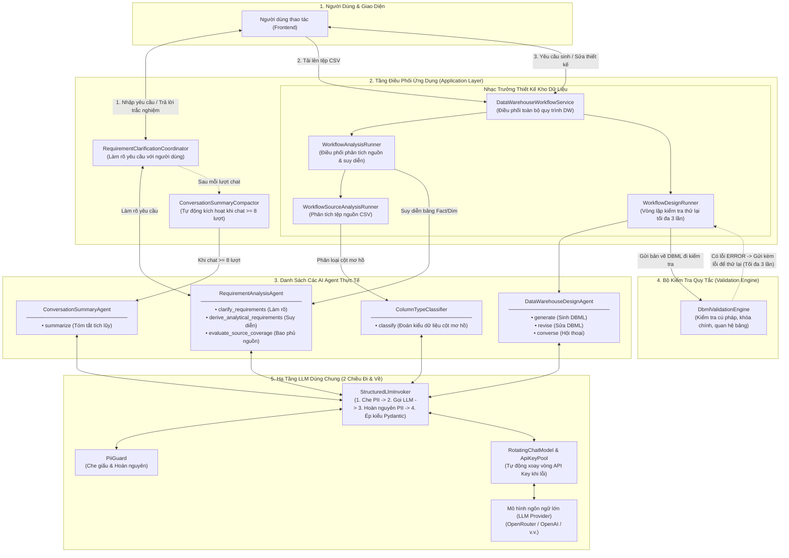

# Kiến Trúc AI Agent Trong Hệ Thống (Thực Tế Từ Mã Nguồn)

Tài liệu này mô tả chi tiết kiến trúc và cơ chế hoạt động của các **AI Agent** đang chạy thực tế trong mã nguồn backend của hệ thống. 

Tất cả nội dung dưới đây được tổng hợp trực tiếp từ mã nguồn thực tế (tại các thư mục `backend/src/infrastructure/agents/`, `backend/src/infrastructure/llm/`, `backend/src/application/`), hoàn toàn không phải lý thuyết hay dự tính.

---

## 1. Triết Lý Thiết Kế AI Agent Của Hệ Thống

Hệ thống không sử dụng các khung làm việc (framework) tự do, phức tạp khó kiểm soát như AutoGen hay CrewAI, mà áp dụng mô hình **AI Agent có cấu trúc và có kiểm soát (Structured & Deterministic Agents)** theo nguyên lý Kiến trúc Sạch (Clean Architecture):

1. **Mỗi tác vụ là một lượt gọi có ranh giới rõ ràng (Single Invocation):** Agent không tự chạy vòng lặp vô tận trên mạng. Mỗi hành động của người dùng tương ứng với một lượt phân tích hoặc một vòng lặp thử lại có giới hạn tối đa được kiểm soát ở tầng ứng dụng (Application Layer).
2. **Đầu ra luôn có cấu trúc chặt chẽ (Structured Output):** Tất cả kết quả trả về từ mô hình ngôn ngữ lớn (LLM) đều được ép kiểu thành cấu trúc dữ liệu Pydantic rõ ràng, không nhận văn bản tự do bừa bãi.
3. **Bảo mật dữ liệu (PII Protection):** Dữ liệu nhạy cảm được che giấu tự động trước khi gửi tới LLM và được hoàn nguyên lại chính xác sau khi nhận kết quả.
4. **Chịu lỗi và tự phục hồi (Resilience):** Hệ thống có cơ chế tự động đổi khóa API (Key Rotation) khi gặp lỗi hạn ngạch/mạng, tự sửa lại định dạng đầu ra (Self-repair) và tự sửa lỗi thiết kế theo quy tắc kiểm tra (Validation Loop).

```
[ Frontend / Người Dùng ]
          │
          ▼
[ Application Service / Coordinator ]  ◄── (Quản lý luồng, kiểm tra quyền, lưu CSDL)
          │
          ├── Gọi ──► [ AI Agent (Tầng Infrastructure) ]
          │                 │
          │                 ├── 1. Che giấu thông tin nhạy cảm (PII Guard)
          │                 ├── 2. Chuẩn bị ngữ cảnh & kiểm soát Token (Context Builder)
          │                 ├── 3. Gọi LLM qua kho khóa xoay vòng (Rotating Chat Model)
          │                 ├── 4. Ép kiểu dữ liệu đầu ra (Structured LLM Invoker)
          │                 └── 5. Hoàn nguyên thông tin (Unmask PII)
          │
          └── Kiểm tra ──► [ Bộ kiểm tra quy tắc (Validation Engine) ]
                                  │ (Nếu có lỗi -> Thử lại tối đa 3 lần)
```

---

## 2. Danh Sách Các AI Agent Và Nhiệm Vụ Trong Code

Hệ thống hiện có 4 thành phần AI Agent / Bộ phân loại LLM chính:

### 2.1. RequirementAnalysisAgent (Agent Phân Tích Yêu Cầu)
* **Vị trí trong mã nguồn:** `backend/src/infrastructure/agents/requirement_analysis_agent.py`
* **Giao diện (Interface):** `IRequirementAnalysisAgent`
* **Gồm 3 chức năng chính:**
  1. **Làm rõ yêu cầu (`clarify_requirements`):**
     * **Đầu vào:** Mô tả nghiệp vụ người dùng nhập, nội dung trích xuất từ tài liệu đính kèm (PDF/Word/TXT), danh sách yêu cầu hiện có và lịch sử trao đổi gần nhất.
     * **Nhiệm vụ:** Đánh giá xem thông tin đã đủ rõ ràng để thiết kế kho dữ liệu chưa.
     * **Đầu ra:** Trạng thái `NEEDS_CLARIFICATION` (Cần hỏi thêm - kèm theo 1 câu hỏi, 1-4 phương án chọn gợi ý, lý do hỏi) hoặc `READY` (Đã đủ rõ ràng - kèm danh sách các yêu cầu nghiệp vụ đã được chuẩn hóa).
  2. **Suy diễn yêu cầu phân tích (`derive_analytical_requirements`):**
     * **Đầu vào:** Danh sách yêu cầu nghiệp vụ đã được xác nhận.
     * **Nhiệm vụ:** Tự động suy luận ra các bảng sự kiện (Fact), bảng chiều (Dimension), các chỉ số đo lường (Metrics), mức độ chi tiết (Granularity) và các phép tính cần thiết.
     * **Kiểm tra chặt chẽ:** Mã nguồn kiểm tra bắt buộc 100% ID của yêu cầu nguồn phải khớp chính xác giữa đầu vào và đầu ra, không được làm mất hoặc tự bịa thêm ID.
  3. **Đánh giá độ bao phủ nguồn dữ liệu (`evaluate_source_coverage`):**
     * **Đầu vào:** Yêu cầu nghiệp vụ, yêu cầu phân tích và Schema dữ liệu nguồn tải lên.
     * **Nhiệm vụ:** Đánh giá source semantics theo `SUPPORTED`, `NEEDS_SOURCE_CONFIRMATION`, `MISSING_SOURCE`; chỉ tham chiếu candidate có thật và mô tả capability nghiệp vụ còn thiếu mà không phát minh tên cột.

### 2.2. DataWarehouseDesignAgent (Agent Thiết Kế Kho Dữ Liệu)
* **Vị trí trong mã nguồn:** `backend/src/infrastructure/agents/data_warehouse_design_agent.py`
* **Giao diện (Interface):** `IDataWarehouseDesignAgent`
* **Gồm 3 chức năng chính:**
  1. **Sinh mô hình dữ liệu ban đầu (`generate`):**
     * **Đầu vào:** Yêu cầu nghiệp vụ, yêu cầu phân tích, cấu trúc dữ liệu nguồn, kèm bản vẽ lỗi và danh sách lỗi kiểm tra trước đó (nếu là lượt thử lại).
     * **Đầu ra:** Mã DBML hoàn chỉnh thiết kế bảng Fact, Dimension, khóa chính, khóa ngoại và quan hệ giữa các bảng.
  2. **Chỉnh sửa mô hình (`revise`):**
     * **Đầu vào:** Bản vẽ DBML hiện tại, câu lệnh yêu cầu chỉnh sửa của người dùng, toàn bộ ngữ cảnh dự án và danh sách lỗi cần sửa.
     * **Đầu ra:** Bản vẽ DBML mới đã cập nhật.
  3. **Hội thoại thiết kế (`converse`):**
     * **Đầu vào:** Bản vẽ hiện tại, câu hỏi/ý kiến của người dùng, lịch sử trò chuyện và bản tóm tắt phiên làm việc.
     * **Đầu ra:** Một trong 3 loại phản hồi:
       * `CLARIFICATION`: Đặt câu hỏi trắc nghiệm để làm rõ ý định của người dùng.
       * `PROPOSAL`: Đề xuất một bản vẽ DBML mới kèm tóm tắt thay đổi.
       * `NO_CHANGE`: Giải thích/trả lời mà không cần sửa đổi bản vẽ.

### 2.3. ConversationSummaryAgent (Agent Tóm Tắt Hội Thoại)
* **Vị trí trong mã nguồn:** `backend/src/infrastructure/agents/conversation_summary_agent.py`
* **Giao diện (Interface):** `IConversationSummaryAgent`
* **Nhiệm vụ:** Khi cuộc trò chuyện giữa người dùng và Agent dài ra (vượt qua một số lượt nhất định), Agent này sẽ chạy ngầm để nén các lượt trao đổi cũ thành một **bản tóm tắt trạng thái tích lũy (Cumulative Summary)**.
* **Cấu trúc bản tóm tắt:**
  * Mục tiêu hiện tại (`current_goal`).
  * Các quyết định đã được người dùng chốt (`confirmed_decisions`).
  * Các câu hỏi đã được giải quyết (`resolved_clarifications`).
  * Các ràng buộc quan trọng (`important_constraints`).
  * Nhiệm vụ đang làm (`current_task`).
  * Câu hỏi còn đang mở (`open_questions`).
  * Bằng chứng truy vết: Mỗi mục tóm tắt bắt buộc phải gắn kèm ID của sự kiện trò chuyện gốc (`evidence_event_ids`) để đảm bảo không bị ảo giác.

### 2.4. ColumnTypeClassifier (Bộ Phân Loại Kiểu Dữ Liệu Cột)
* **Vị trí trong mã nguồn:** `backend/src/infrastructure/llm/column_type_classifier.py`
* **Giao diện (Interface):** `IColumnTypeClassifier`
* **Nhiệm vụ:** Khi người dùng tải lên tệp dữ liệu (CSV/bảng), hệ thống trước tiên dùng bộ luật cứng (Rule-based engine) để nhận diện kiểu cột. Đối với các cột mơ hồ mà luật cứng chưa dám khẳng định, Agent này sẽ nhận thông tin thống kê (tên cột, một vài giá trị mẫu, tỷ lệ rỗng, số giá trị phân biệt) để phân loại chính xác kiểu dữ liệu (TEXT, CATEGORY, INTEGER, NUMBER, DECIMAL, BOOLEAN, DATE, TIME, DATETIME).

---

## 3. Lớp Hạ Tầng Và Cơ Chế Bảo Vệ LLM

Tất cả các Agent đều sử dụng chung một nền tảng hạ tầng bên dưới tại `backend/src/infrastructure/llm/` và `backend/src/infrastructure/security/`:

```
                    ┌────────────────────────────────────────┐
                    │        StructuredLlmInvoker            │
                    └──────────────────┬─────────────────────┘
                                       │
                ┌──────────────────────┴──────────────────────┐
                ▼                                             ▼
     [ 1. Bảo mật dữ liệu ]                        [ 2. Quản lý kết nối LLM ]
     • PiiGuard:                                   • RotatingChatModel:
       - Che tên bảng, tên cột nhạy cảm              - Quản lý danh sách API Key
       - Che thông tin cá nhân (Email, SĐT...)       - Tự động chuyển Key khi lỗi hạn ngạch
       - Hoàn nguyên sau khi nhận kết quả            - Khóa Key hỏng trong suốt phiên chạy
       - Chặn nếu mã che bị méo (Fail closed)       • Provider Registry: OpenRouter / OpenAI / v.v.
```

### 3.1. StructuredLlmInvoker (Thực Thi LLM Có Cấu Trúc)
* **Tác dụng:** Là đầu mối duy nhất thực hiện việc gọi LLM.
* **Quy trình xử lý 5 bước:**
  1. Gửi văn bản người dùng qua `PiiGuard.mask_identifiers()` và `mask_free_text()` để thay thế thông tin nhạy cảm bằng các mã giữ chỗ (placeholder như `<ID_1>`, `<EMAIL_1>`).
  2. Áp dụng schema cấu trúc mong muốn (`chat_model.with_structured_output(Schema)`).
  3. Gửi lệnh tới LLM (kèm `SystemMessage` và `HumanMessage`).
  4. Duyệt qua dữ liệu trả về để hoàn nguyên (Unmask) các mã giữ chỗ trở lại giá trị ban đầu.
  5. Kiểm tra an toàn: Nếu phát hiện mô hình làm méo mó mã giữ chỗ mà không hoàn nguyên được, hệ thống sẽ báo lỗi ngay lập tức (`LLM_PII_DEGRADATION_ERROR`) để tránh rò rỉ hoặc sai lệch dữ liệu.

### 3.2. Quản Lý Khóa API Tự Động (ApiKeyPool & RotatingChatModel)
* **Vị trí trong mã nguồn:** `backend/src/infrastructure/llm/api_key_pool.py`, `rotating_chat_model.py`
* **Cơ chế hoạt động:**
  * Cho phép cấu hình nhiều API Key cùng lúc (ngăn cách bằng dấu phẩy).
  * Khi một API Key bị lỗi hạn ngạch (Rate limit), hết tiền (Quota exceeded) hoặc lỗi xác thực (401/403):
    1. Bộ phân loại lỗi (`LlmFailureClassifier`) nhận diện nguyên nhân.
    2. Tự động vô hiệu hóa key lỗi đó trong phiên làm việc hiện tại.
    3. Ngay lập tức mượn key khả dụng tiếp theo trong kho và thử lại lượt gọi đó.
  * Quá trình này diễn ra hoàn toàn tự động trong cùng 1 request, người dùng không nhận thấy gián đoạn.

### 3.3. Quản Lý Ngân Sách Token Và Ngữ Cảnh (ConversationContextBuilder)
* **Vị trí trong mã nguồn:** `backend/src/infrastructure/agents/conversation_context_builder.py`
* **Cơ chế phân tầng ngữ cảnh (Projection Tiers):**
  * Để không bao giờ vượt quá giới hạn độ dài ngữ cảnh (Context Window) của LLM:
    * **Ưu tiên 1:** Trạng thái chính thức của dự án (Yêu cầu, Schema nguồn, Bản vẽ hiện tại).
    * **Ưu tiên 2:** Bản tóm tắt hội thoại tích lũy (`ConversationSummary`).
    * **Ưu tiên 3:** Các lượt trò chuyện gần nhất (`Recent Turns`).
  * Nếu tổng số Token vượt quá ngân sách cho phép, hệ thống sẽ tự động hạ mức độ chi tiết (Projection Tier) và cắt bỏ dần các lượt trò chuyện cũ nhất cho đến khi vừa vặn với kích thước cho phép.

### 3.4. Tự Sửa Lỗi Định Dạng Hội Thoại (ConversationOutputInvoker)
* **Vị trí trong mã nguồn:** `backend/src/infrastructure/agents/conversation_output_invoker.py`
* Nếu LLM trả về cấu trúc hội thoại thiết kế không đúng mẫu JSON quy định, hệ thống sẽ tự động gắn thêm hướng dẫn sửa lỗi (`OUTPUT_REPAIR_INSTRUCTION`) và gọi lại 1 lần duy nhất để cứu vãn lượt trả lời mà không làm hỏng trải nghiệm người dùng.

---

## 4. Vòng Lặp Phối Hợp Và Kiểm Tra Tự Động (Workflow Runners)

Tại tầng ứng dụng (`Application Layer`), các Agent không hoạt động độc lập mà được điều phối bởi các bộ điều phối luồng:

```
[ Bắt Đầu Sinh/Sửa DBML ]
          │
          ▼
    ┌───────────┐
    │ DW Agent  │ ◄─────────────────────────────────────────┐
    │ Sinh DBML │                                           │
    └─────┬─────┘                                           │ (Thử lại tối đa 3 lần
          │                                                 │  kèm danh sách lỗi)
          ▼                                                 │
┌────────────────────────┐      Phát hiện lỗi (ERROR)      │
│ DbmlValidationEngine   ├──────────────────────────────────┘
│ (Kiểm tra cú pháp,     │
│  khóa chính, quan hệ)  │      Không có lỗi nghiêm trọng
└─────────┬──────────────┘ ─────────────────────────────────┐
          │                                                 │
          ▼                                                 ▼
[ Thất bại sau 3 lần ]                             [ Lưu vào Cơ Sở Dữ Liệu ]
(Báo lỗi rõ ràng cho người dùng)                   (Tạo đề xuất thay đổi / Cập nhật bản vẽ)
```

### 4.1. Vòng Lặp Kiểm Tra Thiết Kế (WorkflowDesignRunner)
* **Vị trí trong mã nguồn:** `backend/src/application/data_warehouse_workflows/design_runner.py`
* **Số lần thử tối đa:** 3 lần (`MAX_DESIGN_ATTEMPTS = 3`).
* **Quy trình:**
  1. Yêu cầu `DataWarehouseDesignAgent` sinh hoặc sửa bản vẽ DBML.
  2. Chuyển bản vẽ DBML qua công cụ kiểm tra luật cứng `DbmlValidationEngine` (`backend/src/infrastructure/validation/`).
  3. Nếu có lỗi nghiêm trọng (mức độ `ERROR` như: thiếu khóa chính, sai kiểu dữ liệu, quan hệ bảng không hợp lệ):
     * Gom toàn bộ danh sách lỗi và bản vẽ vừa sinh đưa ngược lại vào prompt của Agent ở lượt tiếp theo.
     * Agent sẽ dựa trên chính các lỗi này để sửa đổi.
  4. Nếu sau 3 lần vẫn không đạt chuẩn, hệ thống dừng lại và trả về thông báo lỗi rõ ràng (`DATA_MODEL_AGENT_VALIDATION_RETRIES_EXHAUSTED`), tuyệt đối không lưu dữ liệu sai vào hệ thống.

### 4.2. Vai Trò Nhạc Trưởng Của DataWarehouseWorkflowService
* **Vị trí trong mã nguồn:** `backend/src/application/data_warehouse_workflows/data_warehouse_workflow_service.py` và `analysis_runner.py`
* **DataWarehouseWorkflowService có điều khiển Requirement và Source Analysis không?** -> **CÓ.** Đây là bộ điều phối trung tâm cho toàn bộ quy trình thiết kế kho dữ liệu:
  1. Trước khi sinh hoặc cập nhật mô hình dữ liệu (`generate_data_model`, `synchronize_data_model`, `reanalyze`), service này gọi `WorkflowAnalysisRunner.run()`:
     * **Bước 1 (Phân tích nguồn):** Kích hoạt `WorkflowSourceAnalysisRunner` để phân tích các tệp CSV tải lên (gọi `ColumnTypeClassifier` nếu có cột không chắc chắn).
     * **Bước 2 (Suy diễn phân tích):** Nếu danh sách yêu cầu phân tích bị cũ (outdated), gọi `RequirementAnalysisAgent.derive_analytical_requirements()` để suy diễn lại bảng Fact/Dimension/Metrics từ yêu cầu nghiệp vụ và lưu vào CSDL.
     * **Bước 3 (Kiểm tra bao phủ):** Chạy kiểm tra độ bao phủ giữa nguồn dữ liệu và yêu cầu (`WorkflowSourceCoverageRunner`).
  2. Sau khi dữ liệu phân tích đã đồng bộ và sẵn sàng 100%, service mới chuyển dữ liệu sang `WorkflowDesignRunner` để gọi `DataWarehouseDesignAgent` sinh hoặc sửa mã DBML.

### 4.3. ConversationSummaryCompactor Chạy Khi Nào?
* **Vị trí trong mã nguồn:** `backend/src/application/project_sessions/conversation_summary_compactor.py`
* **Thời điểm kích hoạt:** Được gọi tự động ở 2 thời điểm trong mỗi lượt trò chuyện:
  1. **Trước khi trả lời:** Khi hệ thống chuẩn bị bộ nhớ ngữ cảnh (`build_memory`).
  2. **Sau khi trả lời xong:** Khi hệ thống đã lưu thành công lượt hội thoại mới (`compact_after_completion`).
* **Điều kiện thực sự chạy (Ngưỡng kích hoạt):**
  * Hệ thống áp dụng chính sách: Giữ lại **4 lượt trò chuyện gần nhất** (`recent_turns = 4`) và gom nén theo đợt **4 lượt** (`summary_batch_size = 4`).
  * Khi số lượt trò chuyện chưa tóm tắt đạt từ **8 lượt trở lên** (4 + 4):
    * Hệ thống lấy 4 lượt trò chuyện cũ nhất gửi cho `ConversationSummaryAgent`.
    * Agent tổng hợp các lượt cũ này vào bản tóm tắt tích lũy (`ConversationSummary`), gắn ID sự kiện gốc để truy vết, và lưu lại vào phiên làm việc (`ProjectSession`).
    * Nhờ đó, cửa sổ ngữ cảnh gửi tới LLM luôn ngắn gọn, tiết kiệm token và không bị mất thông tin quan trọng.

### 4.4. Đường Đi 2 Chiều Của Dữ Liệu Khi Gọi LLM (Luồng Trả Về)
Khi LLM Provider xử lý xong prompt, kết quả trả về theo đúng chu trình ngược lại:
1. **LLM Provider** trả về chuỗi JSON có cấu trúc.
2. **RotatingChatModel** nhận kết quả, nếu thành công thì đánh dấu key hoạt động tốt (`mark_succeeded`).
3. **StructuredLlmInvoker** nhận đối tượng Pydantic, gọi `PiiGuard.unmask()` để hoàn nguyên tất cả các mã ẩn danh (`<ID_1>`, `<EMAIL_1>`) trở lại tên gốc, và kiểm tra tính hợp lệ của dữ liệu.
4. **AI Agent** (ví dụ `RequirementAnalysisAgent`, `DataWarehouseDesignAgent`) chuyển đổi đối tượng Pydantic thành các DTO/kết quả nghiệp vụ của tầng Domain.
5. **Coordinator / Runner** nhận kết quả từ Agent, thực hiện kiểm tra quy tắc hoặc lưu vào CSDL qua Repository/UnitOfWork.
6. **API Service** trả kết quả cuối cùng về cho Frontend để hiển thị cho người dùng.

---

## 5. Bảng Tóm Tắt Vai Trò Các Tệp Tin Trong Mã Nguồn

| Thư mục / Tệp tin | Vai trò chính trong hệ thống |
| :--- | :--- |
| `infrastructure/agents/requirement_analysis_agent.py` | Agent phân tích yêu cầu nghiệp vụ và suy diễn yêu cầu phân tích. |
| `infrastructure/agents/data_warehouse_design_agent.py` | Agent sinh, chỉnh sửa DBML và hội thoại thiết kế kho dữ liệu. |
| `infrastructure/agents/conversation_summary_agent.py` | Agent tóm tắt và cô đọng lịch sử trò chuyện dài. |
| `infrastructure/agents/conversation_context_builder.py` | Bộ cắt ghép ngữ cảnh và tính toán ngân sách token an toàn. |
| `infrastructure/agents/conversation_output_invoker.py` | Bộ gọi hội thoại có cơ chế tự thử lại khi lỗi cấu trúc đầu ra. |
| `infrastructure/agents/prompts/` | Nơi lưu trữ toàn bộ các mẫu câu lệnh (Prompt) chuẩn hóa của hệ thống. |
| `infrastructure/llm/structured_llm_invoker.py` | Bộ thực thi gọi LLM có che giấu và hoàn nguyên thông tin nhạy cảm. |
| `infrastructure/llm/rotating_chat_model.py` | Bộ bọc kết nối LLM có khả năng tự động xoay vòng và đổi API Key khi lỗi. |
| `infrastructure/llm/api_key_pool.py` | Kho quản lý trạng thái các API Key được cấp phát trong hệ thống. |
| `infrastructure/llm/column_type_classifier.py` | Phân loại kiểu dữ liệu cột cho các trường hợp không rõ ràng. |
| `infrastructure/security/pii_guard.py` | Bộ lọc an toàn thông tin (kết hợp Presidio và nhận diện Schema). |
| `application/data_warehouse_workflows/data_warehouse_workflow_service.py` | Nhạc trưởng điều phối toàn bộ chu trình phân tích nguồn, suy diễn yêu cầu và thiết kế kho dữ liệu. |
| `application/data_warehouse_workflows/analysis_runner.py` | Bộ chạy phân tích tổng hợp (kết hợp Source Analysis và Derive Analytical). |
| `application/data_warehouse_workflows/design_runner.py` | Điều phối vòng lặp thử lại tối đa 3 lần giữa Agent và Bộ kiểm tra DBML. |
| `application/project_sessions/conversation_summary_compactor.py` | Điều phối việc chạy ngầm tóm tắt lịch sử hội thoại khi đạt ngưỡng (>= 8 turns). |

---

## 6. Sơ Đồ Tổng Quan Kiến Trúc Từng AI Agent

Sơ đồ dưới đây thể hiện rõ ràng luồng dữ liệu 2 chiều, vị trí từng con AI Agent và cách các bộ điều phối, bộ kiểm tra cùng hạ tầng LLM phối hợp với nhau:


